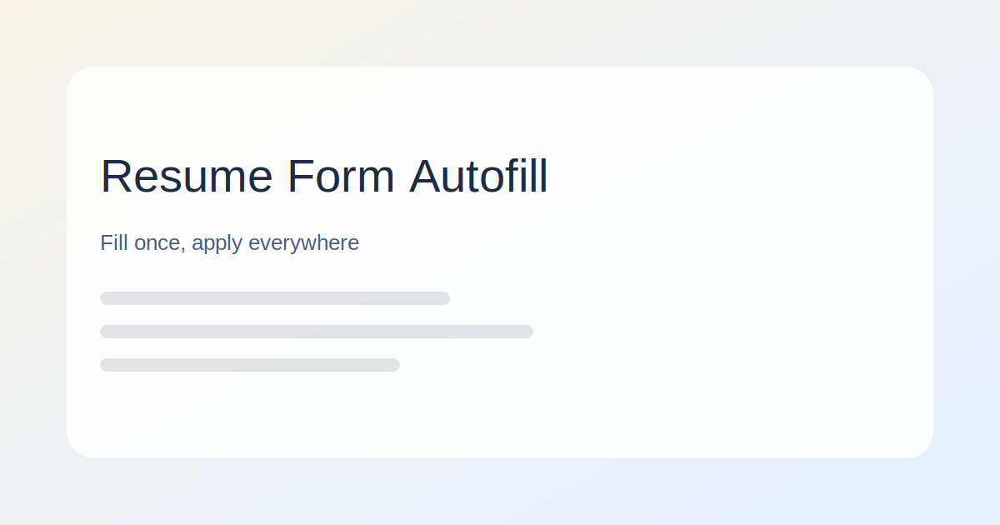

# 简历表单自动填写

一句话简介：只需填写一次简历信息，在多个招聘网站快速自动填写。

## 体验链接

[简历自动填写](https://cv.offernow.cn)

## 适用场景
- 校招、社招高频投递，减少重复填写
- 多站点岗位申请，统一维护个人信息
- 团队内测或演示，用于介绍产品能力

## 关键能力
- 一次录入，多站点自动填写
- 常用字段结构化管理，便于维护与复用
- 插件化形态，贴合浏览器工作流
- 注重隐私，优先本地存储与可控同步

## 使用方式（示例）
1. 安装浏览器插件或获取内测包
2. 打开插件面板，完善简历信息
3. 在招聘网站打开岗位申请页
4. 点击一键填写并检查结果

## 适配网站
- 市面上百分之 90% 的网站
- 更多网站适配中，欢迎反馈需求

## 关键词
简历自动填写, 浏览器插件, 求职效率, 自动投递, 一键填写, Chrome 扩展

---

# Resume Form Autofill

One-line intro: fill your resume once, auto-complete forms across multiple job sites.

This repository is for marketing/SEO display only and does not include core source code.

## Use Cases
- High-volume applications with less repetitive input
- Multi-site job applications with consistent data
- Product demo or internal preview

## Key Capabilities
- Fill once, apply across sites
- Structured fields for easy maintenance
- Browser-first workflow via extension
- Privacy-first with local storage by default

## How It Works (Example)
1. Install the browser extension or get the preview build
2. Fill in your resume details in the panel
3. Open a job application page
4. Click autofill and review the result

## Supported Sites
- ByteDance Jobs (expanding)
- More sites in progress

## GitHub Pages Hosting
You can host this repo as a docs site on GitHub Pages:
1. Push the repo to GitHub
2. Go to Settings -> Pages
3. Select the `main` branch and `/` or `/docs`
4. Save and wait for the published URL

## Keywords
resume autofill, browser extension, job application, form auto fill, Chrome extension

## License
All rights reserved. Commercial use requires permission.
